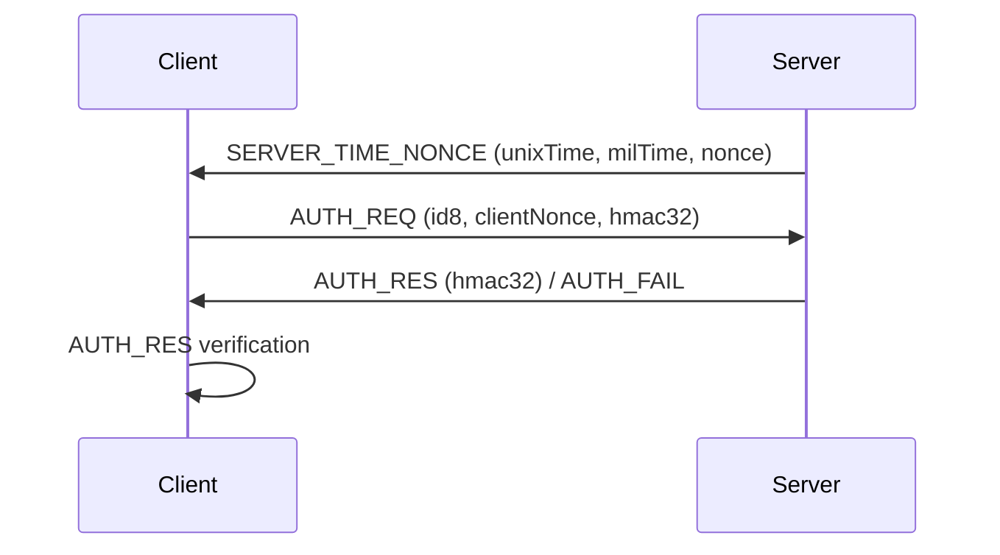

# Boho

[English](README.md) | [한국어](README.ko.md)

**Node.js, 브라우저, Arduino를 위한 경량 암호화 및 인증 프로토콜**

Boho는 공유 키 기반 인증과 바이너리 암호화 메시지를 제공하는 JavaScript 라이브러리입니다. Node.js와 브라우저에서 동작하며, Arduino용 구현은 별도 저장소에서 제공합니다. 현재 프로토콜은 SHA-256을 조합한 자체 암호 구성이며, 표준 AEAD나 TLS의 보안 보장과 동일하게 취급하지 않아야 합니다.

- `boho`는 **보호**를 의미합니다.

---

## 왜 boho를 만들었나요?

boho는 **통신할 양쪽의 코드와 키 설정을 직접 관리할 수 있는 환경**을 위해
만들었습니다. Arduino 장치와 직접 작성한 웹앱, 개인 서버처럼 통신 상대가
정해져 있다면, 먼저 비밀 키를 안전하게 설정하고 그 키로 인증과 암호화를
수행하는 구성이 가능합니다.

이미 많은 암호 알고리즘이 있지만, 실제 개발에는 상대 인증, 메시지 형식,
키 설정, 장치와 브라우저의 호환성도 필요합니다. boho는 SHA-256 기반 키스트림,
XOR 암호화, 공유 키 인증과 바이너리 패킷을 묶어 이 연결을 구성합니다.
차별점은 XOR 자체의 새로움이 아니라 **Arduino·Node.js·브라우저에서 같은
방식으로 사용할 수 있는 구현과 응용 구조**입니다.

### 사전 공유 대칭키가 적합한 환경

| 환경 | 키를 설정하는 방법의 예 |
| --- | --- |
| 직접 제작하는 임베디드 장치 | 제작·설치 시 USB나 직렬 연결로 장치별 키 주입 |
| 직접 관리하는 웹앱과 개인 장치 | 사용자가 별도 경로로 받은 키를 입력하거나 신뢰할 수 있는 페어링 절차로 등록 |
| 관리 주체가 같은 서버 사이 | SSH, 기존 TLS 연결, 비밀 관리 시스템으로 키 배포 |

이처럼 최초 키 공유를 해결할 수 있다면, 적절한 대칭키 암호화와 인증으로도
안전한 통신을 설계할 수 있습니다. 인증기관 없이 공유 키를 확인하는 상대 인증도
가능합니다. 이때 신뢰의 기반은 키 설정 경로와 양쪽 프로그램입니다.
키를 여러 장치에 공통으로 배포하면 유출 영향과 인증 범위도 함께 넓어지므로
장치별 키와 교체·폐기 방법을 마련해야 합니다.

웹앱의 코드를 직접 작성한다고 키가 자동으로 비밀이 되지는 않습니다.
공개 JavaScript 번들에 공통 비밀 키를 포함하면 방문자가 읽을 수 있습니다.

### XOR와 OTP의 기초 원리

XOR는 같은 값으로 두 번 연산하면 원래 값으로 돌아오는 매우 단순한 연산입니다.

```text
암호화: C = P XOR S
복호화: P = C XOR S

P: 평문, C: 암호문, S: 키스트림
```

평문과 독립적인 완전한 무작위 키스트림을 데이터 길이만큼 준비하여 비밀로
유지하고 한 번만 쓰면, 일회용 패드(One-Time Pad, OTP)의 완전한 비밀성을
얻습니다. 단순한 XOR도 이런 조건에서는 강력한 암호화의 기반이 됩니다.
문제는 1MB 데이터를 보낼 때마다 새로운 1MB 비밀 패드를 양쪽에 공급해야 한다는
점입니다. 짧은 고정 키를 반복하여 XOR하는 방식은 이 조건을 만족하지 않습니다.

같은 키스트림을 두 번 사용하면 `C1 XOR C2 = P1 XOR P2`가 되어 평문 사이의
관계가 노출됩니다. 안전성을 결정하는 것은 XOR의 복잡도가 아니라 키스트림의
생성과 재사용 방지입니다.

### SHA-256 출력으로 만드는 ‘가상 OTP’

충분히 예측하기 어려운 비밀 입력과 메시지별 값을 해시에 넣고, 블록 번호를
바꾸며 출력을 생성하면 필요한 길이의 키스트림을 만드는 구성을 생각할 수 있습니다.
양쪽이 같은 입력을 사용하면 같은 출력을 재현하므로 전체 패드를 미리 저장하거나
전송할 필요가 없습니다. boho의 일반적인 `set_key` 경로는 다음과 같습니다.

```text
K  = SHA256(입력 키)
B  = SHA256(K || salt12)
S1 = SHA256(B || LE32(1))
S2 = SHA256(B || LE32(2))
…
S  = S1 || S2 || …              // 평문 길이만큼 사용
C  = P XOR S
```

`||`는 바이트열 연결, `LE32`는 4바이트 little-endian 정수입니다.
SHA-256 출력은 32바이트이므로 70바이트 평문에는 두 블록과 세 번째 블록의
앞 6바이트를 사용합니다. 복호화는 해시를 역산하지 않고 같은 키스트림으로 XOR합니다.

`salt12`는 초 단위 시각 4바이트, 밀리초 2바이트, 카운터 2바이트와 nonce
4바이트로 구성됩니다. 이 정보는 비밀 키가 아니며 수신자도 얻을 수 있습니다.
**공개된 랜덤 값만 해시하면 누구나 같은 출력을 계산할 수 있습니다.** 비밀
키스트림의 핵심은 공유 비밀 키이고, 같은 키 아래에서 `salt12`를 재사용하지
않는 것도 중요합니다.

여기서 ‘가상 OTP’는 해시 기반 의사난수 키스트림을 설명하는 표현입니다.
짧은 키에서 긴 출력을 만들기 때문에 진짜 OTP의 정보이론적 안전성과는 다릅니다.
표준 SHA-256을 사용한다는 사실만으로 조합 전체의 안전성이 보장되지는 않습니다.
키스트림과 XOR라는 큰 구조는 [ChaCha20](https://www.rfc-editor.org/rfc/rfc8439.html#section-2.4)에도
쓰이지만, boho는 이와 별개의 자체 구성입니다.

XOR만으로는 변조를 검출할 수 없으므로, boho의 데이터 패킷에는
`SHA256(K || salt12 || 평문)`의 앞 8바이트로 계산한 검증 태그도 포함됩니다.
기존 코드의 `HMAC` 명칭과 달리 이 태그는 표준 HMAC이 아닙니다.
수신자는 복호화와 태그 검증이 모두 성공한 데이터만 사용해야 합니다.

### TLS와 비교할 때의 관점

일반적인 인증서 기반 TLS는 미리 비밀을 공유하지 않은 상대와 인증 및 키 합의를
수행하고, 실제 데이터는 대칭키로 보호합니다. 따라서 웹 서비스는 방문자에게
비밀 키를 미리 배포하지 않아도 됩니다. 로그인하지 않은 사용자도 서버를 인증하고
암호화 연결을 만들 수 있지만, 이는 네트워크 익명성을 제공한다는 뜻은 아닙니다.

작은 임베디드 프로젝트에서는 인증서 체인, 신뢰 루트, 유효기간과 시각 관리,
갱신, 핸드셰이크 연산과 버퍼가 부담이 될 수 있습니다. 비용은 인증서 구매비만이
아니라 코드 크기, 메모리, 전력과 운영 시간도 포함합니다. 이미 안전하게 키를
설정할 수 있는 환경에서는 이런 구성 중 일부를 줄일 여지가 있습니다.

다만 **TLS도 PSK-only 및 PSK+(EC)DHE 방식을 지원**하므로, TLS를 항상 공개키와
제3자 인증서가 필요한 방식으로 구분해서는 안 됩니다.
[TLS 1.3의 PSK 방식](https://www.rfc-editor.org/rfc/rfc8446.html#section-2.2)

boho의 경량화 목표는 공개키 연산과 인증서 처리를 구성에서 제외하고, 응용 패킷
보호와 공유 키 인증을 제공하는 것입니다. 모든 장치에서 TLS나 표준 대칭키
구현보다 빠르거나 메모리를 덜 사용한다는 뜻은 아니며 실제 비교에는 측정이 필요합니다.

### Arduino·웹앱·IOSignal에서의 활용

boho의 Arduino와 JavaScript 구현으로 DIY 장치, Node.js 서버, 브라우저 웹앱
사이에 암호화 패킷을 교환할 수 있습니다. boho가 암호화·인증을 담당하고,
[IOSignal](https://github.com/remocons/iosignal)과
[IOSignal for Arduino](https://github.com/remocons/iosignal-arduino)가 연결과 메시지 전달을 담당합니다.

연결 인증용 키와 종단간 암호화(E2E)용 데이터 키는 목적이 다릅니다. 중계 서버가
본문을 읽지 못하게 하려면 최종 송수신자만 별도의 데이터 키를 공유해야 합니다.
일반 연결 암호화만으로 E2E가 되지는 않으며, E2E도 라우팅 정보와 트래픽 크기를
모두 숨기지는 않습니다.

웹앱 코드가 변조되면 키와 평문도 노출될 수 있으므로 일반 웹 배포에서는
HTTPS/WSS와 함께 사용할 수 있습니다. boho는 브라우저의 mixed content 정책을
우회하지 않으며, E2E에서도 웹앱 코드 제공자에 대한 신뢰는 필요합니다.

### 적용할 때 함께 확인할 조건

- 강한 무작위 키를 사용해야 합니다. `set_key`의 SHA-256 한 번은 짧은 비밀번호용 느린 KDF가 아닙니다.
- JavaScript는 `crypto.getRandomValues()`를 사용하지만 현재 Arduino 구현은 독립 패킷과 인증 요청의 클라이언트 nonce에 `micros()`를 사용합니다. 이는 암호학적 난수가 아니므로 재시작·여러 장치·통신 방향을 포함한 키와 `salt12` 중복을 검토해야 합니다.
- 유효한 태그만으로 새 메시지임을 알 수 없습니다. challenge 만료, 재전송 거부, 순서와 실행 권한은 호출 측에서 관리해야 합니다.
- boho는 자체 프로토콜입니다. 표준 AEAD/TLS와 같은 보안 보장이나 장기 키 유출 후 과거 통신을 보호하는 순방향 비밀성을 제공한다고 취급해서는 안 됩니다.

---

## 주요 기능

- 범용 암호화 및 복호화
- 상호 인증 프로토콜 (아래 참조)
- 인증 후 보안 통신
- 종단간(End-to-End) 대칭 암호화
- TypeScript 타입 정의 포함
- JavaScript (Node.js, 브라우저) 및 C/C++ (Arduino) 지원

---

## 라이브러리

- **JavaScript:** Node.js, 웹 브라우저 ([GitHub](https://github.com/remocons/boho))
- **C/C++:** Arduino ([GitHub](https://github.com/remocons/boho-arduino))

---

## 대표적인 사용 사례

- WebSocket 인증 및 보안 메시징
- 보안 TCP/직렬/스트림 통신
- 보안 MQTT 페이로드
- 로컬 파일 암호화

---

## 주요 API

- `encryptPack`, `decryptPack`: 범용 암호화/복호화
- `encrypt_488`, `decrypt_488`: 인증 후 보안 통신
- `encrypt_e2e`, `decrypt_e2e`: 종단간 암호화
- `RAND(size)`: 안전한 랜덤 버퍼 생성
- `sha256.hash`, `sha256.hex`, `sha256.base64`, `sha256.hmac`: 해싱 유틸리티

---

## 인증 프로토콜 (요약)

boho 라이브러리의 서버-클라이언트 인증(AUTH) 프로세스는 다음과 같은 단계로 이루어집니다.

---

### 1. 서버 → 클라이언트: SERVER_TIME_NONCE

- 서버는 현재 시각(초/밀리초)과 랜덤 nonce를 포함한 `SERVER_TIME_NONCE` 메시지를 클라이언트에 보냅니다.
- 메시지 타입: `BohoMsg.SERVER_TIME_NONCE`
- 내용: unixTime, milTime, nonce

### 2. 클라이언트 → 서버: AUTH_REQ

- 클라이언트는 서버로부터 받은 nonce와 시각 정보를 바탕으로 salt12를 생성하고, 자신의 nonce를 새로 만듭니다. JavaScript는 랜덤 nonce를, 현재 Arduino는 `micros()`를 사용합니다.
- salt12와 자신의 nonce를 합쳐 인증 태그를 생성한 뒤, `AUTH_REQ` 메시지로 서버에 전송합니다.
- 메시지 타입: `BohoMsg.AUTH_REQ`
- 내용: id8, clientNonce, hmac32

### 3. 서버: AUTH_REQ 검증 및 응답

- 서버는 클라이언트의 인증 태그가 올바른지 검증합니다.
- 검증 성공 시, 서버는 자신의 인증 태그를 생성하여 `AUTH_RES` 메시지로 클라이언트에 응답합니다.
- 실패 시, `AUTH_FAIL` 메시지를 보낼 수 있습니다.

### 4. 클라이언트: AUTH_RES 검증

- 클라이언트는 서버의 `AUTH_RES` 메시지에 포함된 인증 태그가 올바른지 검증합니다.
- 검증이 성공하면, 양쪽 모두 `isAuthorized = true` 상태가 되어 이후 암호화 통신이 가능합니다.

---

### 메시지 플로우 요약



---

### 각 단계의 목적

- **SERVER_TIME_NONCE**: 서버가 연결별 challenge를 제공하고, 사용 수명과 재사용 정책은 호출 측이 관리
- **AUTH_REQ**: 클라이언트가 서버의 정보를 바탕으로 인증 태그 생성(서버가 검증)
- **AUTH_RES**: 서버가 클라이언트의 인증 성공을 알리고, 클라이언트는 서버의 인증 태그 검증 상호 인증
- **AUTH_FAIL**: 인증 실패 시 서버가 전송

---

### 특징 및 보안성

- 인증은 서버가 보관한 challenge 값에 대해 검증합니다. challenge의 만료·재사용 제한, 인증 시도 제한 및 최종 접속 승인은 iosignal 등 호출 측에서 관리합니다.
- 인증 태그 기반 상호 인증으로, 키를 노출하지 않고 인증 가능
- `ENC_488`은 양측 인증 후 사용합니다. `ENC_PACK`과 E2E는 별도의 사전 인증 없이 명시적으로 설정한 키로 동작합니다.

---

boho의 인증 프로토콜은 서버와 클라이언트가 nonce와 시각 정보를 교환하고, 인증 태그를 통해 상호 인증하는 구조입니다. 이후 인증된 세션에서 암호화 메시지를 교환합니다.

---

## 사용 예제

### 일반 데이터 암호화 및 복호화

```js
import Boho from 'boho'

  let boho = new Boho()

  // 실제 통신에서는 상대와 안전하게 공유한 무작위 키를 사용합니다.
  boho.set_key(Boho.RAND(32))

  let data = 'aaaaaaaa'

  let encData = boho.encryptPack( data )
  console.log('encData buffer:', encData )
  let result = boho.decryptPack( encData )

  if(result){
    console.log('result object:', result )
    printMessage(result.data)  // decode to string.
  }else{
    console.log('decryption is fail')
  }

  function printMessage(data){
    let dataStr = new TextDecoder().decode( data )
    console.log('\n result string:',dataStr)
  }

```

### Boho를 사용한 인증 및 보안 통신 예제는 `IOSignal`을 참고하세요.

- `iosignal` ([GitHub](https://github.com/remocons/iosignal))
- test/AUTH_process.js

---

## TypeScript 지원

기본 export인 `Boho` 클래스와 `Boho.RAND`, `Boho.Buffer`, `Boho.MBP` 등의 정적 속성에 타입 정의를 제공합니다. `import Boho from 'boho'`를 사용하세요. `import { Boho, RAND } from 'boho'` 형태의 값 export는 제공하지 않습니다.

## 수신 정책과 보안 범위

- 내부 메서드 이름의 `HMAC`과 패킷 필드의 `hmac`은 호환성을 위한 기존 이름입니다. 실제 프로토콜 태그는 `SHA256(내부 키 || salt || 데이터)`이며, 표준 HMAC이 아닙니다. 유틸리티 `Boho.sha256.hmac(key, data)`는 표준 HMAC입니다.
- `set_key`는 비어 있지 않은 키를 요구합니다. 키 미설정 상태의 `encryptPack`은 예외를 발생시키며, `clearAuth`는 키도 삭제합니다. `copy_key`는 정확히 32바이트만 허용합니다.
- Boho는 중복 수신 캐시나 인증 단계 제한을 강제하지 않습니다. `ENC_488`의 중복·순서·시간 신선도 검사, challenge 만료 및 접속 상태 관리는 iosignal 등 호출 측 책임입니다. 인증 태그가 유효하다는 사실만으로 새 메시지임을 보장하지 않습니다.
- `set_key`/`copy_key`는 기존 `isAuthorized`를 자동 변경하지 않습니다. 재인증·키 교체·종료 시 호출 측이 상태를 명시적으로 관리해야 합니다.
- JS 송신은 시계가 뒤로 이동하거나 카운터가 같은 밀리초 안에 순환해도 값이 증가하도록 유지합니다. 수신은 기존 Arduino의 시간 보정·카운터 순환을 허용하며 수신 이력 정책을 적용하지 않습니다.
- `ENC_PACK`과 E2E는 독립 메시지/저장 데이터용이며 반복 복호화를 허용합니다. 이 API의 재전송 검출은 호출 측 책임입니다.
- 잘린 패킷, 잘못된 유형/길이, 검증값 불일치는 복호화 시 `undefined`로 거부합니다. `ENC_PACK`/`ENC_488`은 추가 바이트도 거부합니다. iosignal의 `ENC_E2E`는 예외로, 선언된 길이의 라우팅 헤더만 복호화하고 뒤의 E2E 본문은 전달 계층이 보존합니다. 이 본문의 검증은 최종 수신자의 `decrypt_e2e`가 담당합니다.
- 짧은 비밀번호를 위한 느린 KDF, 순방향 비밀성, E2E 키 배포는 제공하지 않습니다. nonce 및 태그 크기를 포함한 암호 설계 개선은 새 프로토콜 버전에서 다뤄야 합니다.

## 개발 검증

`npm test`는 배포 파일을 먼저 재빌드하고, 소스·ESM·브라우저 UMD(Node VM)의 회귀 테스트와 TypeScript 검사를 수행합니다. 실제 브라우저 및 물리 Arduino 장치 검사는 별도입니다.

`npm run test:arduino`는 인접한 `../boho-arduino/src/Boho.cpp`를 수정 없이 호스트 C++ 컴파일러로 빌드해 JS와 양방향 통신을 검증합니다. 다른 위치는 `BOHO_ARDUINO_PATH` 환경 변수로 지정하세요. macOS는 CommonCrypto, 다른 호스트는 OpenSSL 개발 라이브러리가 필요합니다. 테스트용 시계·Serial·SHA-256 어댑터를 사용하므로 물리 장치 테스트를 대체하지 않습니다.

`npm run test:iosignal`은 인접한 `../iosignal` 및 `../iosignal-arduino`의 실제 소스를 사용합니다. 수정 Boho를 JS 서버와 클라이언트에 로더로 주입하고, Arduino IOSignal의 80바이트 RX 버퍼와 메모리 전송 계층으로 인증·일반 통신·E2EE 양방향 경로를 검사합니다. `IOSIGNAL_PATH`, `IOSIGNAL_ARDUINO_PATH`로 경로를 지정할 수 있습니다. 실제 AVR의 SRAM 사용량이나 물리 네트워크를 검증하는 테스트는 아닙니다.

오류 목록과 호환성 영향은 [수정 내역](docs/SECURITY_FIXES.md)을 참고하세요.

---

## 라이선스

MIT
