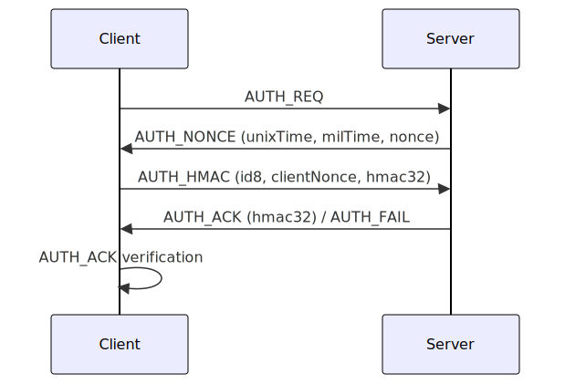

[ en | [kr](./docs/README-kr.md) ]

# Boho

**Secure Lightweight Encryption & Authentication Library for Node.js, Browsers, and Arduino**

Boho is a lightweight JavaScript library for robust encryption, authentication, and secure communication. Designed for Node.js, browsers, and embedded systems (such as Arduino), Boho provides simple APIs for random value generation, SHA256 hashing, HMAC, and secure message packing. It is ideal for IoT, embedded, and web applications that require strong security with minimal overhead.

- `boho` means Protection

---

## Features
- General-purpose encryption and decryption
- Mutual authentication protocol (see below)
- Secure communication after authentication
- End-to-End symmetric encryption
- TypeScript type definitions included
- Supports JavaScript (Node.js, Browser) and C/C++ (Arduino)

---

## Libraries
- **JavaScript:** Node.js, Web Browser ([GitHub](https://github.com/remocons/boho))
- **C/C++:** Arduino ([GitHub](https://github.com/remocons/boho-arduino))

---

## Typical Applications
- WebSocket authentication and secure messaging
- Secure TCP/Serial/Stream communication
- Secure MQTT payloads
- Local file encryption

---

## Core Concepts
- **SHA256** for hashing
- **xotp**: XOR-based one-time pad
- **generateOTP**: OTP generation
- **generateHMAC**: HMAC for authentication

---

## Main APIs
- `encryptPack`, `decryptPack`: General-purpose encryption/decryption
- `encrypt_488`, `decrypt_488`: Secure communication after authentication
- `encrypt_e2e`, `decrypt_e2e`: End-to-end encryption
- `RAND(size)`: Secure random buffer generation
- `sha256.hash`, `sha256.hex`, `sha256.base64`, `sha256.hmac`: Hashing utilities

---

## Authentication Protocol (Summary)
Boho uses a mutual authentication protocol based on random nonces and HMAC:

1. **AUTH_REQ**: Client initiates authentication
2. **AUTH_NONCE**: Server responds with time and random nonce
3. **AUTH_HMAC**: Client sends HMAC using server's nonce and its own
4. **AUTH_ACK**: Server verifies and responds with its own HMAC
5. **AUTH_FAIL**: Sent by server if authentication fails

See [`AUTH_PROCESS.md`](./docs/AUTH_PROCESS.md) for a detailed protocol description.

### Authentication Message Flow Diagram



---

## Example Usage

### general data encryption & decryption
```js
import Boho from 'boho'

  let boho = new Boho()

  boho.set_key('abc' )

  let data = 'aaaaaaaa'

  let encData = boho.encryptPack( data )
  console.log('encData buffer:', encData )
  let result = boho.decryptPack( encData )
  
  if(result){  
    console.log('result object:', result )
    printMessage(result.data)  // decode to string.
  }else{
    console.log('decryption is fail')
  }

  function printMessage(data){
    let dataStr = new TextDecoder().decode( data )
    console.log('\n result string:',dataStr)
  }

```

### For examples of authentication and secure communication using Boho, please refer to `IOSignal`.
- `iosignal` ([GitHub](https://github.com/remocons/iosignal))
- test/AUTH_process.js

---

## TypeScript Support
Boho provides full TypeScript type definitions. Simply install and import to get autocompletion and type checking in your TypeScript projects.

---

## License
MIT
