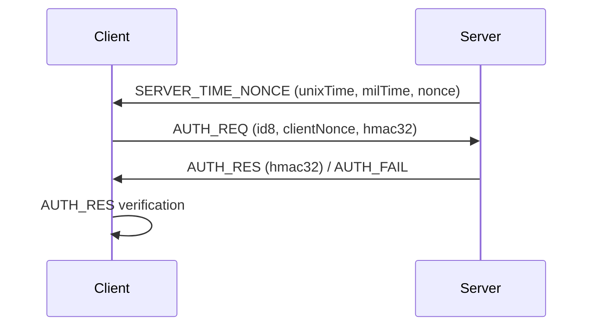

# Boho

**Node.js, 브라우저, Arduino를 위한 경량 암호화 및 인증 프로토콜**

Boho는 공유 키 기반 인증과 바이너리 암호화 메시지를 제공하는 JavaScript 라이브러리입니다. Node.js와 브라우저에서 동작하며, Arduino용 구현은 별도 저장소에서 제공합니다. 현재 프로토콜은 SHA-256을 조합한 자체 암호 구성이며, 표준 AEAD나 TLS의 보안 보장과 동일하게 취급하지 않아야 합니다.

- `boho`는 **보호**를 의미합니다.

---

## 주요 기능
- 범용 암호화 및 복호화
- 상호 인증 프로토콜 (아래 참조)
- 인증 후 보안 통신
- 종단간(End-to-End) 대칭 암호화
- TypeScript 타입 정의 포함
- JavaScript (Node.js, 브라우저) 및 C/C++ (Arduino) 지원

---

## 라이브러리
- **JavaScript:** Node.js, 웹 브라우저 ([GitHub](https://github.com/remocons/boho))
- **C/C++:** Arduino ([GitHub](https://github.com/remocons/boho-arduino))

---

## 대표적인 사용 사례
- WebSocket 인증 및 보안 메시징
- 보안 TCP/직렬/스트림 통신
- 보안 MQTT 페이로드
- 로컬 파일 암호화

---

## 주요 API
- `encryptPack`, `decryptPack`: 범용 암호화/복호화
- `encrypt_488`, `decrypt_488`: 인증 후 보안 통신
- `encrypt_e2e`, `decrypt_e2e`: 종단간 암호화
- `RAND(size)`: 안전한 랜덤 버퍼 생성
- `sha256.hash`, `sha256.hex`, `sha256.base64`, `sha256.hmac`: 해싱 유틸리티

---

## 인증 프로토콜 (요약)

boho 라이브러리의 서버-클라이언트 인증(AUTH) 프로세스는 다음과 같은 단계로 이루어집니다.

---

### 1. 서버 → 클라이언트: SERVER_TIME_NONCE
- 서버는 현재 시각(초/밀리초)과 랜덤 nonce를 포함한 `SERVER_TIME_NONCE` 메시지를 클라이언트에 보냅니다.
- 메시지 타입: `BohoMsg.SERVER_TIME_NONCE`
- 내용: unixTime, milTime, nonce

### 2. 클라이언트 → 서버: AUTH_REQ
- 클라이언트는 서버로부터 받은 nonce와 시각 정보를 바탕으로 salt12를 생성하고, 자신의 랜덤 nonce를 새로 만듭니다.
- salt12와 자신의 nonce를 합쳐 인증 태그를 생성한 뒤, `AUTH_REQ` 메시지로 서버에 전송합니다.
- 메시지 타입: `BohoMsg.AUTH_REQ`
- 내용: id8, clientNonce, hmac32

### 3. 서버: AUTH_REQ 검증 및 응답
- 서버는 클라이언트의 인증 태그가 올바른지 검증합니다.
- 검증 성공 시, 서버는 자신의 인증 태그를 생성하여 `AUTH_RES` 메시지로 클라이언트에 응답합니다.
- 실패 시, `AUTH_FAIL` 메시지를 보낼 수 있습니다.

### 4. 클라이언트: AUTH_RES 검증
- 클라이언트는 서버의 `AUTH_RES` 메시지에 포함된 인증 태그가 올바른지 검증합니다.
- 검증이 성공하면, 양쪽 모두 `isAuthorized = true` 상태가 되어 이후 암호화 통신이 가능합니다.

---

### 메시지 플로우 요약


```mermaid
sequenceDiagram
    participant Client
    participant Server

    Server->>Client: SERVER_TIME_NONCE (unixTime, milTime, nonce)
    Client->>Server: AUTH_REQ (id8, clientNonce, hmac32)
    Server->>Client: AUTH_RES (hmac32) / AUTH_FAIL
    Client->>Client: AUTH_RES verification
```

---

### 각 단계의 목적

- **SERVER_TIME_NONCE**: 서버가 연결별 challenge를 제공하고, 사용 수명과 재사용 정책은 호출 측이 관리
- **AUTH_REQ**: 클라이언트가 서버의 정보를 바탕으로 인증 태그 생성(서버가 검증)
- **AUTH_RES**: 서버가 클라이언트의 인증 성공을 알리고, 클라이언트는 서버의 인증 태그 검증 상호 인증
- **AUTH_FAIL**: 인증 실패 시 서버가 전송

---

### 특징 및 보안성

- 인증은 서버가 보관한 challenge 값에 대해 검증합니다. challenge의 만료·재사용 제한, 인증 시도 제한 및 최종 접속 승인은 iosignal 등 호출 측에서 관리합니다.
- 인증 태그 기반 상호 인증으로, 키를 노출하지 않고 인증 가능
- `ENC_488`은 양측 인증 후 사용합니다. `ENC_PACK`과 E2E는 별도의 사전 인증 없이 명시적으로 설정한 키로 동작합니다.

---

boho의 인증 프로토콜은 서버와 클라이언트가 nonce와 시각 정보를 교환하고, 인증 태그를 통해 상호 인증하는 구조입니다. 이후 인증된 세션에서 암호화 메시지를 교환합니다.

---

## 사용 예제

### 일반 데이터 암호화 및 복호화
```js
import Boho from 'boho'

  let boho = new Boho()

  // 실제 통신에서는 상대와 안전하게 공유한 무작위 키를 사용합니다.
  boho.set_key(Boho.RAND(32))

  let data = 'aaaaaaaa'

  let encData = boho.encryptPack( data )
  console.log('encData buffer:', encData )
  let result = boho.decryptPack( encData )

  if(result){
    console.log('result object:', result )
    printMessage(result.data)  // decode to string.
  }else{
    console.log('decryption is fail')
  }

  function printMessage(data){
    let dataStr = new TextDecoder().decode( data )
    console.log('
 result string:',dataStr)
  }

```

### Boho를 사용한 인증 및 보안 통신 예제는 `IOSignal`을 참고하세요.
- `iosignal` ([GitHub](https://github.com/remocons/iosignal))
- test/AUTH_process.js

---

## TypeScript 지원
기본 export인 `Boho` 클래스와 `Boho.RAND`, `Boho.Buffer`, `Boho.MBP` 등의 정적 속성에 타입 정의를 제공합니다. `import Boho from 'boho'`를 사용하세요. `import { Boho, RAND } from 'boho'` 형태의 값 export는 제공하지 않습니다.

## 수신 정책과 보안 범위

- 내부 메서드 이름의 `HMAC`과 패킷 필드의 `hmac`은 호환성을 위한 기존 이름입니다. 실제 프로토콜 태그는 `SHA256(내부 키 || salt || 데이터)`이며, 표준 HMAC이 아닙니다. 유틸리티 `Boho.sha256.hmac(key, data)`는 표준 HMAC입니다.
- `set_key`는 비어 있지 않은 키를 요구합니다. 키 미설정 상태의 `encryptPack`은 예외를 발생시키며, `clearAuth`는 키도 삭제합니다. `copy_key`는 정확히 32바이트만 허용합니다.
- Boho는 중복 수신 캐시나 인증 단계 제한을 강제하지 않습니다. `ENC_488`의 중복·순서·시간 신선도 검사, challenge 만료 및 접속 상태 관리는 iosignal 등 호출 측 책임입니다. 인증 태그가 유효하다는 사실만으로 새 메시지임을 보장하지 않습니다.
- `set_key`/`copy_key`는 기존 `isAuthorized`를 자동 변경하지 않습니다. 재인증·키 교체·종료 시 호출 측이 상태를 명시적으로 관리해야 합니다.
- JS 송신은 시계가 뒤로 이동하거나 카운터가 같은 밀리초 안에 순환해도 값이 증가하도록 유지합니다. 수신은 기존 Arduino의 시간 보정·카운터 순환을 허용하며 수신 이력 정책을 적용하지 않습니다.
- `ENC_PACK`과 E2E는 독립 메시지/저장 데이터용이며 반복 복호화를 허용합니다. 이 API의 재전송 검출은 호출 측 책임입니다.
- 잘린 패킷, 잘못된 유형/길이, 검증값 불일치는 복호화 시 `undefined`로 거부합니다. `ENC_PACK`/`ENC_488`은 추가 바이트도 거부합니다. iosignal의 `ENC_E2E`는 예외로, 선언된 길이의 라우팅 헤더만 복호화하고 뒤의 E2E 본문은 전달 계층이 보존합니다. 이 본문의 검증은 최종 수신자의 `decrypt_e2e`가 담당합니다.
- 짧은 비밀번호를 위한 느린 KDF, 순방향 비밀성, E2E 키 배포는 제공하지 않습니다. nonce 및 태그 크기를 포함한 암호 설계 개선은 새 프로토콜 버전에서 다뤄야 합니다.

## 개발 검증

`npm test`는 배포 파일을 먼저 재빌드하고, 소스·ESM·브라우저 UMD(Node VM)의 회귀 테스트와 TypeScript 검사를 수행합니다. 실제 브라우저 및 물리 Arduino 장치 검사는 별도입니다.

`npm run test:arduino`는 인접한 `../boho-arduino/src/Boho.cpp`를 수정 없이 호스트 C++ 컴파일러로 빌드해 JS와 양방향 통신을 검증합니다. 다른 위치는 `BOHO_ARDUINO_PATH` 환경 변수로 지정하세요. macOS는 CommonCrypto, 다른 호스트는 OpenSSL 개발 라이브러리가 필요합니다. 테스트용 시계·Serial·SHA-256 어댑터를 사용하므로 물리 장치 테스트를 대체하지 않습니다.

`npm run test:iosignal`은 인접한 `../iosignal` 및 `../iosignal-arduino`의 실제 소스를 사용합니다. 수정 Boho를 JS 서버와 클라이언트에 로더로 주입하고, Arduino IOSignal의 80바이트 RX 버퍼와 메모리 전송 계층으로 인증·일반 통신·E2EE 양방향 경로를 검사합니다. `IOSIGNAL_PATH`, `IOSIGNAL_ARDUINO_PATH`로 경로를 지정할 수 있습니다. 실제 AVR의 SRAM 사용량이나 물리 네트워크를 검증하는 테스트는 아닙니다.

오류 목록과 호환성 영향은 [수정 내역](docs/SECURITY_FIXES.md)을 참고하세요.

---

## 라이선스
MIT
