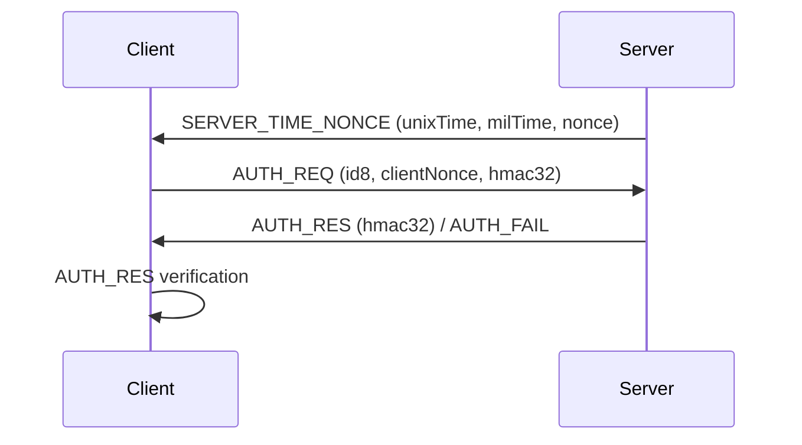

# Boho

[English](README.md) | [한국어](README.ko.md)

**Lightweight encryption and authentication for Node.js, browsers and Arduino**

Boho is a JavaScript library providing shared-key authentication and encrypted
binary messages. It runs in Node.js and browsers; the Arduino implementation is
available in a separate repository. The current protocol is a custom SHA-256-based
construction and must not be treated as providing the same guarantees as standard
AEAD or TLS.

- `boho` means **protection** in Korean.

---

## Why Boho?

Boho is designed for environments where **you control the code and key provisioning
at both endpoints**. With known peers such as an Arduino device, your own web app
and a personal server, you can provision a secret securely before using it for
authentication and encryption.

Many encryption algorithms already exist, but practical development also needs
peer authentication, packet formats, key provisioning and compatibility between
devices and browsers. Boho combines a SHA-256-based keystream, XOR encryption,
shared-key authentication and binary packets. Its distinction is **a common
implementation and application model for Arduino, Node.js and browsers**, rather
than novelty in XOR itself.

### Where pre-shared symmetric keys fit

| Environment | Example provisioning path |
| --- | --- |
| Embedded devices you build | Provision device-specific keys over USB or serial during manufacture or installation |
| Your own web app and personal device | Users enter a key obtained separately, or register it through trusted pairing |
| Servers under common administration | Distribute keys through SSH, an existing TLS channel or a secret management system |

If initial key sharing is handled, appropriate symmetric encryption and
authentication can provide secure communication. Peers can authenticate through
their shared key without a certificate authority. Trust rests on the provisioning
path and endpoint software. Sharing one key across many devices expands both its
authentication scope and the impact of a leak; plan device-specific keys,
rotation and revocation.

Writing a web app yourself does not automatically keep its key secret. A common
secret included in a public JavaScript bundle is readable by visitors.

### XOR and one-time pads

XOR is a simple operation: applying it twice with the same value restores the
original value.

```text
Encryption: C = P XOR S
Decryption: P = C XOR S

P: plaintext, C: ciphertext, S: keystream
```

A uniformly random keystream that is independent of the plaintext, as long as the
data, kept secret and used only once provides the perfect secrecy of a one-time
pad (OTP). Under these conditions even simple XOR forms the basis of strong
encryption. The practical difficulty is supplying a new 1 MB secret pad to both
endpoints for every 1 MB of data. Repeating a short fixed key does not meet these
conditions.

Reusing a keystream exposes `C1 XOR C2 = P1 XOR P2`, revealing a relationship
between the plaintexts. Security depends on keystream generation and avoiding
reuse, not on the complexity of XOR.

### A “virtual OTP” generated with SHA-256

Hashing sufficiently unpredictable secret input together with message-specific
values, while varying a block index, can form a construction that generates a
keystream of the required length. Both peers can reproduce the same output from
the same input, without storing or transmitting the entire pad. Boho's usual
`set_key` path is:

```text
K  = SHA256(input key)
B  = SHA256(K || salt12)
S1 = SHA256(B || LE32(1))
S2 = SHA256(B || LE32(2))
…
S  = S1 || S2 || …              // use only the plaintext length
C  = P XOR S
```

`||` means byte concatenation; `LE32` is a four-byte little-endian integer.
SHA-256 produces 32 bytes, so a 70-byte plaintext uses two full blocks and the
first six bytes of the third. Decryption XORs with the same keystream rather than
reversing the hash.

`salt12` contains seconds (4 bytes), milliseconds (2), a counter (2) and a nonce
(4). These values are not secret and are available to the receiver. **Anyone can
compute a hash of public random values alone.** The shared secret key is the
essential secret input; avoiding reuse of `salt12` under the same key is also
important.

“Virtual OTP” here describes a hash-based pseudorandom keystream. Expanding a short
key into a long output does not provide the information-theoretic security of a
true OTP. Using standard SHA-256 does not establish the security of the whole
construction. Keystream generation followed by XOR also appears in
[ChaCha20](https://www.rfc-editor.org/rfc/rfc8439.html#section-2.4), but Boho is a
separate custom construction.

XOR alone does not detect tampering. Boho data packets also contain a verification
tag: the first eight bytes of `SHA256(K || salt12 || plaintext)`. Despite the
legacy `HMAC` names in the code, this tag is not standard HMAC. Receivers must use
data only after decryption and tag verification succeed.

### Comparing with TLS

Typical certificate-based TLS authenticates peers and establishes keys without
requiring a previously shared secret, then protects application data with
symmetric encryption. Web services therefore do not need to distribute a secret
to each visitor in advance. Even users who have not logged in can authenticate a
server and establish an encrypted connection; this does not imply network
anonymity.

For small embedded projects, certificate chains, trust roots, validity and clock
management, renewal, handshake work and buffers can be burdensome. Costs include
code size, memory, power and operating time, not just certificate purchases.
Systems that can already provision keys securely may be able to omit some of
this machinery.

However, **TLS also supports PSK-only and PSK with (EC)DHE**, so it should not be
described as always requiring public-key exchange and third-party certificates.
[TLS 1.3 pre-shared keys](https://www.rfc-editor.org/rfc/rfc8446.html#section-2.2)

Boho's lightweight goal is to provide application-packet protection and shared-key
authentication without public-key operations or certificate handling in its
construction. This does not mean it is faster or uses less memory than every TLS
or standard symmetric implementation; actual comparisons require measurement.

### Arduino, web apps and IOSignal

Boho's Arduino and JavaScript implementations exchange encrypted packets between
DIY devices, Node.js servers and browser apps. Boho handles encryption and
authentication, while [IOSignal](https://github.com/remocons/iosignal) and
[IOSignal for Arduino](https://github.com/remocons/iosignal-arduino) handle
connections and message delivery.

Connection credentials and end-to-end (E2E) data keys serve different purposes.
To keep the body confidential from a relay, only the final endpoints should hold
its separate data key. Ordinary connection encryption is not automatically E2E,
and E2E does not hide all routing information or traffic sizes.

Modified web app code can expose keys and plaintext, so normal web deployments
can use HTTPS/WSS alongside Boho. Boho does not bypass browser mixed content
rules, and E2E still requires trust in the provider of the web app code.

### Conditions to check when applying Boho

- Use strong random keys. A single SHA-256 in `set_key` is not a slow password KDF.
- JavaScript uses `crypto.getRandomValues()`, but Arduino currently uses `micros()` for standalone-packet nonces and the authentication client nonce. This is not a cryptographic random source; consider repeated key/`salt12` combinations across restarts, devices and communication directions.
- A valid tag alone does not prove that a message is new. The caller manages challenge expiry, replay rejection, ordering and permission to execute commands.
- Boho is a custom protocol. Do not assume standard AEAD/TLS guarantees or forward secrecy protecting past traffic after a long-term key leak.

---

## Features

- General-purpose encryption and decryption
- Mutual authentication protocol (see below)
- Encrypted communication after authentication
- End-to-end symmetric encryption
- TypeScript declarations
- JavaScript (Node.js, browsers) and C/C++ (Arduino) implementations

---

## Libraries

- **JavaScript:** Node.js and browsers ([GitHub](https://github.com/remocons/boho))
- **C/C++:** Arduino ([GitHub](https://github.com/remocons/boho-arduino))

---

## Typical use cases

- WebSocket authentication and encrypted messaging
- Encrypted TCP, serial and stream communication
- Encrypted MQTT payloads
- Local file encryption

---

## Main APIs

- `encryptPack`, `decryptPack`: general-purpose encryption and decryption
- `encrypt_488`, `decrypt_488`: encrypted communication after authentication
- `encrypt_e2e`, `decrypt_e2e`: end-to-end encryption
- `RAND(size)`: cryptographically secure random buffer generation
- `sha256.hash`, `sha256.hex`, `sha256.base64`, `sha256.hmac`: hashing utilities

---

## Authentication protocol overview

The Boho client–server authentication (AUTH) exchange follows these steps.

---

### 1. Server → client: SERVER_TIME_NONCE

- The server sends `SERVER_TIME_NONCE` containing the current time (seconds/milliseconds) and a random nonce.
- Message type: `BohoMsg.SERVER_TIME_NONCE`
- Contents: unixTime, milTime, nonce

### 2. Client → server: AUTH_REQ

- The client constructs salt12 from the server's nonce and time, and creates its own nonce. JavaScript uses a random nonce; Arduino currently uses `micros()`.
- It computes an authentication tag using salt12 and its nonce, then sends `AUTH_REQ`.
- Message type: `BohoMsg.AUTH_REQ`
- Contents: id8, clientNonce, hmac32

### 3. Server: verify AUTH_REQ and respond

- The server verifies the client's authentication tag.
- On success, it generates its own tag and returns `AUTH_RES`.
- On failure, it may send `AUTH_FAIL`.

### 4. Client: verify AUTH_RES

- The client verifies the authentication tag in `AUTH_RES`.
- Once verification succeeds, both peers have `isAuthorized = true` and can exchange encrypted messages.

---

### Message flow


```mermaid
sequenceDiagram
    participant Client
    participant Server

    Server->>Client: SERVER_TIME_NONCE (unixTime, milTime, nonce)
    Client->>Server: AUTH_REQ (id8, clientNonce, hmac32)
    Server->>Client: AUTH_RES (hmac32) / AUTH_FAIL
    Client->>Client: AUTH_RES verification
```

---

### Purpose of each step

- **SERVER_TIME_NONCE**: provides a per-connection server challenge; the caller manages its lifetime and reuse policy.
- **AUTH_REQ**: the client generates an authentication tag from the server's information for server verification.
- **AUTH_RES**: the server responds after verifying the client; the client verifies the server's tag for mutual authentication.
- **AUTH_FAIL**: the server sends this on authentication failure.

---

### Properties and security scope

- Authentication verifies against the challenge stored by the server. Challenge expiry and reuse restrictions, attempt limits and final connection approval belong to the caller, such as IOSignal.
- Tag-based mutual authentication avoids transmitting the key itself.
- `ENC_488` is used after mutual authentication. `ENC_PACK` and E2E operate with an explicitly configured key without requiring a prior authentication exchange.

---

Boho exchanges nonces and time information between the server and client, then
uses authentication tags for mutual authentication. The authenticated session can
subsequently exchange encrypted messages.

---

## Usage example

### General-purpose encryption and decryption

```js
import Boho from 'boho'

  let boho = new Boho()

  // In real communication, use a random key securely shared with the peer.
  boho.set_key(Boho.RAND(32))

  let data = 'aaaaaaaa'

  let encData = boho.encryptPack( data )
  console.log('encData buffer:', encData )
  let result = boho.decryptPack( encData )

  if(result){
    console.log('result object:', result )
    printMessage(result.data)  // decode to string.
  }else{
    console.log('decryption is fail')
  }

  function printMessage(data){
    let dataStr = new TextDecoder().decode( data )
    console.log('\n result string:',dataStr)
  }

```

### Authentication and encrypted communication examples

See `IOSignal` and the authentication example:

- `iosignal` ([GitHub](https://github.com/remocons/iosignal))
- test/AUTH_process.js

---

## TypeScript support

Declarations cover the default-exported `Boho` class and static properties such
as `Boho.RAND`, `Boho.Buffer` and `Boho.MBP`. Use `import Boho from 'boho'`.
Named value exports such as `import { Boho, RAND } from 'boho'` are not provided.

## Receive policy and security scope

- Internal `HMAC` names and packet `hmac` fields are retained for compatibility. Protocol tags actually use `SHA256(internal key || salt || data)`, not standard HMAC. The utility `Boho.sha256.hmac(key, data)` is standard HMAC.
- `set_key` requires a nonempty key. `encryptPack` throws if no key is configured, and `clearAuth` also clears the key. `copy_key` accepts exactly 32 bytes.
- Boho does not enforce a duplicate-receive cache or authentication-stage restrictions. Duplicate, ordering and freshness checks for `ENC_488`, challenge expiry and connection state belong to the caller, such as IOSignal. A valid tag alone does not prove freshness.
- `set_key`/`copy_key` do not automatically change `isAuthorized`. The caller must explicitly manage state during reauthentication, key changes and shutdown.
- JS sending maintains increasing clock/counter values even if the clock moves backward or the counter wraps within the same millisecond. Receiving permits existing Arduino clock adjustments and counter wrapping, without enforcing receive-history policy.
- `ENC_PACK` and E2E support independent messages and stored data, permitting repeated decryption. Replay detection for these APIs belongs to the caller.
- Decryption rejects truncated packets, invalid types/lengths and tag mismatches with `undefined`. `ENC_PACK`/`ENC_488` also reject extra bytes. IOSignal's `ENC_E2E` is an exception: only the routing header of the declared length is decrypted, and the delivery layer preserves the trailing E2E body. The final recipient verifies that body with `decrypt_e2e`.
- A slow KDF for short passwords, forward secrecy and E2E key distribution are not provided. Cryptographic design changes, including nonce and tag sizes, require a new protocol version.

## Development checks

Open the [browser test page on GitHub Pages](https://remocons.github.io/boho/test-browser/) to run the random generation, encryption/decryption and authentication tests in your browser. Tests run automatically when the page loads.

`npm test` first rebuilds distribution files, then runs regression tests for the
source, ESM and browser UMD (in a Node VM), plus TypeScript checks. Actual browser
and physical Arduino tests are separate.

`npm run test:arduino` compiles the adjacent `../boho-arduino/src/Boho.cpp`
unchanged with a host C++ compiler and checks bidirectional JS communication.
Set `BOHO_ARDUINO_PATH` for a different location. macOS uses CommonCrypto; other
hosts need OpenSSL development libraries. Test clock, Serial and SHA-256 adapters
mean this does not replace physical device tests.

`npm run test:iosignal` uses the actual sources in adjacent `../iosignal` and
`../iosignal-arduino`. A loader injects the modified Boho into the JS server and
client, and tests authentication plus ordinary/E2EE traffic in both directions
using Arduino IOSignal's 80-byte RX buffer and an in-memory transport.
`IOSIGNAL_PATH` and `IOSIGNAL_ARDUINO_PATH` override those locations. This does not
test actual AVR SRAM usage or physical networking.

See [security fixes](docs/SECURITY_FIXES.md) for the issue list and compatibility
impact.

---

## License

MIT
