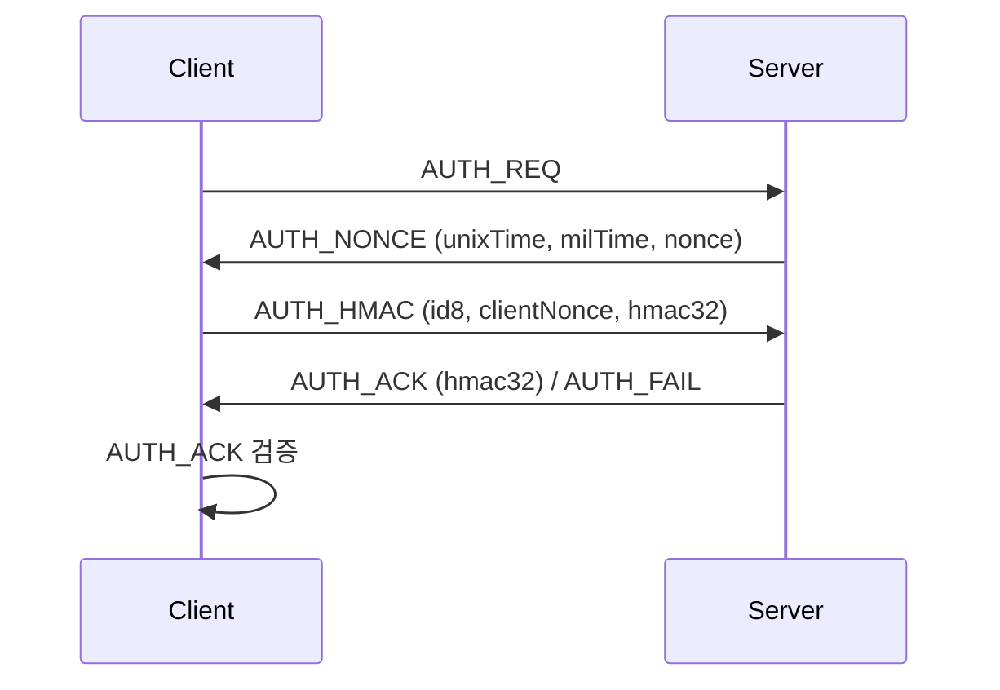

[ 📚 ](./README-kr.md) [ [en](./AUTH_PROCESS.md) | kr ]

# Boho 서버-클라이언트 인증 프로세스

boho 라이브러리의 서버-클라이언트 인증(AUTH) 프로세스는 다음과 같은 단계로 이루어집니다.

---

## 1. 클라이언트 → 서버: AUTH_REQ
- 클라이언트가 인증을 시작하기 위해 `AUTH_REQ` 메시지를 서버로 전송합니다.
- 메시지 타입: `BohoMsg.AUTH_REQ`

## 2. 서버 → 클라이언트: AUTH_NONCE
- 서버는 현재 시각(초/밀리초)과 랜덤 nonce를 포함한 `AUTH_NONCE` 메시지를 클라이언트에 보냅니다.
- 메시지 타입: `BohoMsg.AUTH_NONCE`
- 내용: unixTime, milTime, nonce

## 3. 클라이언트 → 서버: AUTH_HMAC
- 클라이언트는 서버로부터 받은 nonce와 시각 정보를 바탕으로 salt12를 생성하고, 자신의 랜덤 nonce를 새로 만듭니다.
- salt12와 자신의 nonce를 합쳐 HMAC을 생성한 뒤, `AUTH_HMAC` 메시지로 서버에 전송합니다.
- 메시지 타입: `BohoMsg.AUTH_HMAC`
- 내용: id8, clientNonce, hmac32

## 4. 서버: AUTH_HMAC 검증 및 응답
- 서버는 클라이언트의 HMAC이 올바른지 검증합니다.
- 검증 성공 시, 서버는 자신의 HMAC을 생성하여 `AUTH_ACK` 메시지로 클라이언트에 응답합니다.
- 실패 시, `AUTH_FAIL` 메시지를 보낼 수 있습니다.

## 5. 클라이언트: AUTH_ACK 검증
- 클라이언트는 서버의 `AUTH_ACK` 메시지에 포함된 HMAC이 올바른지 검증합니다.
- 검증이 성공하면, 양쪽 모두 `isAuthorized = true` 상태가 되어 이후 암호화 통신이 가능합니다.

---

## 메시지 플로우 요약

---

## 각 단계의 목적

- **AUTH_REQ**: 인증 시작 신호
- **AUTH_NONCE**: 서버가 시간/nonce를 제공하여 리플레이 공격 방지
- **AUTH_HMAC**: 클라이언트가 서버의 정보를 바탕으로 HMAC 생성(서버가 검증)
- **AUTH_ACK**: 서버가 클라이언트의 인증 성공을 알리고, 추가 HMAC으로 상호 인증
- **AUTH_FAIL**: 인증 실패 시 서버가 전송

---

## 특징 및 보안성

- 서버와 클라이언트 모두 랜덤 nonce와 시각 정보를 사용하여, 리플레이 공격에 강함
- HMAC 기반 상호 인증으로, 키를 노출하지 않고 인증 가능
- 인증이 완료되어야만 이후 암호화 통신(ENC_488, ENC_PACK 등)이 가능

---

boho의 인증 프로토콜은 서버와 클라이언트가 nonce와 시각 정보를 교환하고, HMAC을 통해 상호 인증하는 구조입니다. 이 과정을 통해 안전하게 세션을 설정하고, 이후 암호화된 데이터 통신이 가능합니다. 