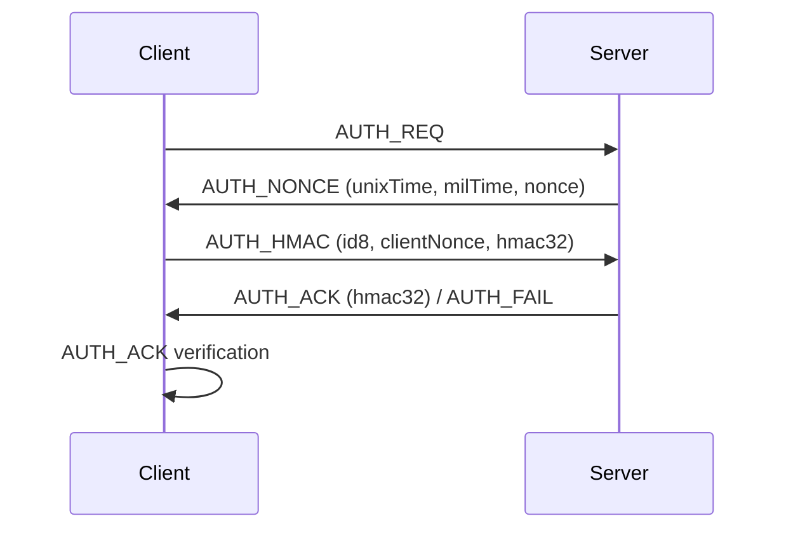

[ 📚 ](../README.md) [ en | [kr](./AUTH_PROCESS-kr.md) ]

# Boho Server-Client Authentication Process

The boho library's server-client authentication (AUTH) process consists of the following steps:

---

## 1. Client → Server: AUTH_REQ
- The client initiates authentication by sending an `AUTH_REQ` message to the server.
- Message type: `BohoMsg.AUTH_REQ`

## 2. Server → Client: AUTH_NONCE
- The server responds with an `AUTH_NONCE` message containing the current time (seconds/milliseconds) and a random nonce.
- Message type: `BohoMsg.AUTH_NONCE`
- Contents: unixTime, milTime, nonce

## 3. Client → Server: AUTH_HMAC
- The client generates a salt12 using the received nonce and time information, and creates its own random nonce.
- The client creates an HMAC using salt12 and its own nonce, then sends it to the server as an `AUTH_HMAC` message.
- Message type: `BohoMsg.AUTH_HMAC`
- Contents: id8, clientNonce, hmac32

## 4. Server: AUTH_HMAC Verification & Response
- The server verifies the client's HMAC.
- If verification succeeds, the server generates its own HMAC and responds with an `AUTH_ACK` message.
- If verification fails, the server may send an `AUTH_FAIL` message.

## 5. Client: AUTH_ACK Verification
- The client verifies the HMAC included in the server's `AUTH_ACK` message.
- If verification succeeds, both sides set `isAuthorized = true` and can proceed with encrypted communication.

---

## Message Flow Summary

---

## Purpose of Each Step

- **AUTH_REQ**: Initiates authentication
- **AUTH_NONCE**: Server provides time/nonce to prevent replay attacks
- **AUTH_HMAC**: Client generates HMAC based on server info (server verifies)
- **AUTH_ACK**: Server notifies client of successful authentication and provides mutual authentication with an additional HMAC
- **AUTH_FAIL**: Sent by server on authentication failure

---

## Security Features

- Both server and client use random nonces and time information, making the protocol robust against replay attacks
- HMAC-based mutual authentication allows secure verification without exposing keys
- Encrypted communication (ENC_488, ENC_PACK, etc.) is only possible after successful authentication

---

The boho authentication protocol is designed for secure session establishment by exchanging nonces and time information and performing mutual authentication using HMAC. This ensures a safe session and enables encrypted data communication afterwards. 